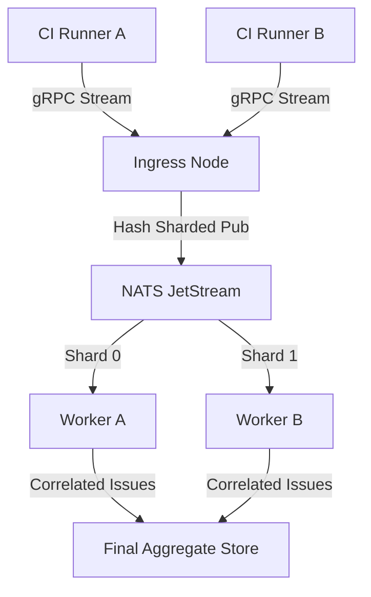

# axon v0.2.0: Distributed Streaming & AI Remediation

## 🌐 1. Distributed gRPC / NATS Ingestion

To handle 100+ concurrent CI/CD runners, `axon` will transition from a standalone CLI to a **Distributed Ingestion Architecture**.

### **The Architecture**
- **Ingress Layer:** A gRPC server implementation of `ports.Parser`. Runners will stream `domain.Evidence` directly to a central `axon` cluster.
- **Message Broker:** Integration with **NATS JetStream** for persistent, high-throughput evidence buffering.
- **Sharded Worker Cluster:** Multiple `axon` instances sub-subscribe to specific hash-shards from NATS. This allows the deduplication logic to scale horizontally across multiple nodes while maintaining the lock-free "single worker per hash" guarantee.



---

## 🤖 2. AI-Assisted Remediation (Guardrails Strategy)

We will introduce a `RemediationProvider` interface that enables LLM-driven fix suggestions. To ensure security and trust, we follow a strict **"Human-in-the-Loop"** pattern.

### **The Interface Pattern**
1.  **Suggest:** The LLM receives the `domain.Issue` (Root Cause) and suggests a remediation script (e.g., a Terraform snippet or a `Dockerfile` patch).
2.  **Explain:** The provider *must* output a reasoning block explaining *why* the fix is safe and what security principles it adheres to.
3.  **User Confirm:** In CLI mode, the tool will pause and present the fix for review. In CI mode, it will only log the suggestion and fail to auto-apply by default.
4.  **Execute:** If confirmed, the fix is applied to the local filesystem or pushed to a remediation branch.

```go
type RemediationProvider interface {
    // SuggestFix returns a proposed fix, a clear explanation, and a confidence score.
    SuggestFix(ctx context.Context, issue domain.Issue) (Proposal, error)
}

type Proposal struct {
    Script      string  // The actual fix (diff or code)
    Explanation string  // The "Why"
    Confidence  float32 // 0.0 - 1.0
}
```

---
*Moving toward a real-time, autonomous security truth stream.*

